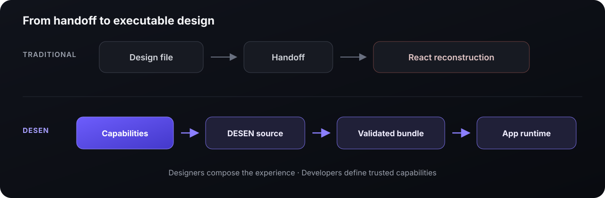

# DESEN

## Design the interface that ships.

DESEN is an open protocol and Web/React reference implementation for a model in which designers
author production interfaces as validated data—rather than handing static design files to
developers for reimplementation.

**Traditional workflow**

`Design file → Handoff → Frontend rebuild → Drift`

**DESEN**

`Product capabilities → Authoring → Validated bundle → Application runtime`

The designer owns the experience composition. The developer owns the trusted components,
operations, and platform.

## The first proof

We are building one deliberately narrow vertical slice:

A sign-in surface is authored, validated, published, and activated in a separately built React
application—without recreating the same screen as a second React component tree.

> **Status:** public, early-stage implementation.
>
> DESEN 0.1.0 is frozen as the current proof baseline, not a stable standard.

[See the architecture](https://github.com/desenlab/desen-app/blob/main/docs/architecture/ARCHITECTURE.md)
· [Read the protocol](https://github.com/desenlab/desen-protocol)
· [Challenge an assumption](https://github.com/desenlab/desen-app/issues/new)

---

## Build status

The framework-neutral runtime core is currently under construction. Progress below is synchronized
from the public implementation repository.

<!-- desen-progress:start -->

**Overall:** `███████░░░░░░░░░░░░░░░░░░` **39 / 144 tasks complete (27%)**

**M04 progress:** `██░░░░░░░░░░░░░░` **2 / 16 tasks complete (13%)**

**Proof gates:** **4 / 13 complete** · **Next:** `M04-T03`

[Follow the detailed task board](https://github.com/desenlab/desen-app/blob/main/docs/plan/TASKS.md)

<!-- desen-progress:end -->

The repository is open for scrutiny before it is ready for adoption. Questions, counterexamples,
and challenges to the model are welcome.
